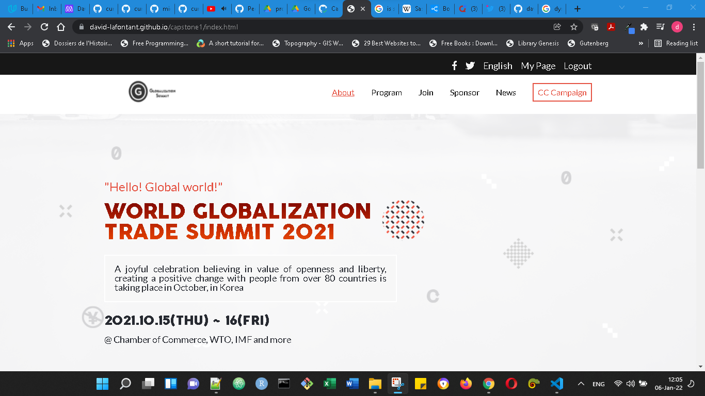

# HTML/CSS & JavaScript capstone project - Conference page
## Learning objectives
- Use semantic HTML tags.
- Apply best practices in HTML code.
- Use CSS selectors correctly.
- Use CSS box model.
- Use Flexbox to place elements in the page.
- Demonstrate ability to create UIs adaptable to different screen sizes using media queries.
- Use GitHub Pages to deploy web pages.
- Apply JavaScript best practices and language style guides in code.
- Use JavaScript to manipulate DOM elements.
- Use JavaScript events.
- Use objects to store and access data.
- Communicate technical concepts to other technical people.

  #  WORLD GLOBALIZATION TRADE SUMMIT 2021

World Globalization Trade Summit is an event organized to encourage trade and exchange around the world. This event is intended to promote free trade policy and evaluate the effective trade from different points of view. Top Scholars, Politics, Activists, and Business People are among the speakers of this event.

## Desktop version

## Mobile version

## Built With

- HTML, CSS, JavaScript, GIT, & SASS.
- - Technologies used: GitHub, VScode, Windows 11 .
- 

## Live Demo

[Live Demo Link](https://david-lafontant.github.io/capstone1/index.html)

## Video Preview

Video [Video](https://www.loom.com/share/9ad870ae58c843d9b355f8f282e2e3b3)

## Getting Started

To get a local copy up and running follow these simple example steps.

### Prerequisites

- A device that support running browser applications.
- access to internet connection.

### Setup

#### View pages from the browser

- If you just want to check the webpage/webapp, you have it available on the live demo link.

#### Install locally the code of the application

In order to install a local version of this project and please do the following steps:
- Install the latest version of a Code editor.
- install the latest version of GIT. 
- Go to the repository [Repository](https://github.com/david-lafontant/capstone1)
- Clone the repository
- Play with the code and enjoy :confetti_ball:

## Author

👤 **David Lafontant**

- GitHub: [@githubhandle](https://github.com/david-lafontant)
- Twitter: [@twitterhandle](https://twitter.com/manikatex)

## 🤝 Contributing

Contributions, issues, and feature requests are welcome!

Feel free to check the [issues page](../../issues/).

## Show your support

Give a ⭐️ if you like this project!

## Acknowledgments

👤 **Cindy Shin**

- [Template](https://www.behance.net/gallery/29845175/CC-Global-Summit-2015)

## Other Resources

- Font Squirrel [Font Squirrel](https://www.fontsquirrel.com/tools/webfont-generator)
- Font Awesome [Font Awesome](https://fontawesome.com/)
- Mobile simulator [Mobile simulator - responsive testing tool](https://chrome.google.com/webstore/detail/mobile-simulator-responsi/ckejmhbmlajgoklhgbapkiccekfoccmk)
## 📝 License

This project is [MIT](LICENCE.md) licensed.